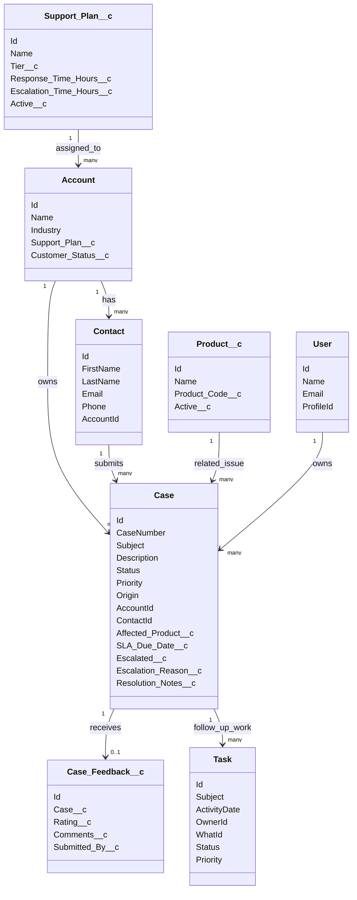
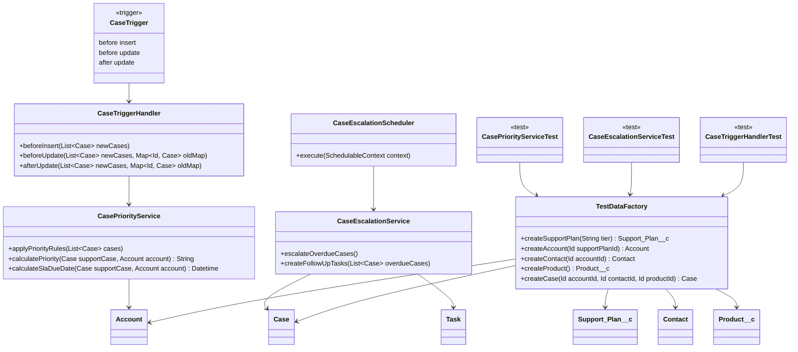

# SupportFlow CRM Project Blueprint

## 1. Project Overview

**SupportFlow CRM** is a Salesforce portfolio project for learning Salesforce development through a realistic customer support application.

The app helps a company manage customer support cases, assign priorities, calculate SLA deadlines, escalate overdue cases, collect customer feedback, and report on support performance.

This project is designed to teach both sides of Salesforce:

- **Admin/configuration work**: objects, fields, relationships, validation rules, page layouts, permissions, queues, reports, and dashboards.
- **Developer work**: Apex triggers, Apex classes, SOQL, bulk-safe logic, scheduled Apex, test classes, and deployment through VS Code.

By the end, this should be strong enough to discuss on a resume and in interviews.

---

## 2. Resume-Ready Project Summary

Built **SupportFlow CRM**, a Salesforce customer support management application using standard and custom objects, Apex triggers, SOQL, scheduled Apex, validation rules, permission sets, queues, and dashboards to automate case prioritization, SLA escalation, and support reporting.

---

## 3. Main Business Problem

A fictional company needs a better way to manage customer support.

The company wants to:

- Track customer accounts and contacts.
- Track support cases submitted by customers.
- Connect each case to a product.
- Assign customers to support plans such as Basic, Premium, and Enterprise.
- Automatically prioritize important cases.
- Calculate SLA deadlines.
- Escalate overdue cases.
- Create follow-up tasks for support agents.
- Collect customer feedback after case resolution.
- Give managers dashboards for support performance.

---

## 4. Core Salesforce Concepts This Project Teaches

### Platform Concepts

- Salesforce CRM basics
- Standard objects
- Custom objects
- Custom fields
- Lookup relationships
- Page layouts
- Record ownership
- Queues
- Permission sets
- Validation rules
- Reports and dashboards

### Developer Concepts

- Apex classes
- Apex triggers
- Trigger handler pattern
- Service classes
- SOQL queries
- DML updates
- Bulk-safe Apex
- Governor limits
- Scheduled Apex
- Test classes
- Test data factories
- Deployment from VS Code

---

## 5. Recommended Workflow

Use both Salesforce Setup and VS Code.

### Salesforce Website

Use Salesforce Setup for:

- Creating apps
- Creating objects
- Creating fields
- Creating relationships
- Configuring page layouts
- Creating validation rules
- Creating queues
- Creating reports
- Creating dashboards
- Testing behavior manually

### VS Code

Use VS Code for:

- Apex classes
- Apex triggers
- Apex tests
- SOQL files or query practice
- Salesforce CLI commands
- Retrieving metadata
- Deploying metadata
- Git/GitHub version control

This gives you a more professional and holistic workflow than using only the browser Developer Console.

---

## 6. Application Modules

### Customer Management

Tracks customer companies and people.

Objects:

- `Account`
- `Contact`
- `Support_Plan__c`

### Case Management

Tracks support issues submitted by customers.

Objects:

- `Case`
- `Product__c`
- `Task`

### SLA and Escalation

Automatically calculates deadlines and escalates cases.

Code:

- `CaseTrigger`
- `CaseTriggerHandler`
- `CasePriorityService`
- `CaseEscalationService`
- `CaseEscalationScheduler`

### Feedback and Reporting

Captures customer satisfaction after support cases are closed.

Objects:

- `Case_Feedback__c`

Reports:

- Open cases by priority
- Escalated cases
- SLA breaches
- Cases by support plan
- Feedback score by account

---

## 7. Roadmap

### Phase 1: Salesforce Org and Project Setup

Goal: Get your development environment ready.

Build:

- Create or log in to a Salesforce Developer Edition org.
- Install Salesforce CLI.
- Install VS Code.
- Install Salesforce Extension Pack.
- Create a Salesforce DX project.
- Authorize the org from VS Code.
- Confirm you can deploy/retrieve metadata.

You should understand:

- What a Salesforce org is.
- What metadata means in Salesforce.
- Why VS Code is used for Apex.
- How local code connects to Salesforce.

Deliverable:

- Working Salesforce project connected to your Developer Edition org.

---

### Phase 2: Create the Salesforce App

Goal: Create the main app shell.

Build:

- App name: `SupportFlow CRM`
- Navigation items:
  - Accounts
  - Contacts
  - Cases
  - Products
  - Support Plans
  - Case Feedback
  - Reports
  - Dashboards

You should understand:

- What a Lightning app is.
- How navigation items work.
- How Salesforce apps organize objects for users.

Deliverable:

- A usable Salesforce app with the main tabs visible.

---

### Phase 3: Data Model

Goal: Create the objects, fields, and relationships.

Use standard objects:

- `Account`
- `Contact`
- `Case`
- `User`
- `Task`

Create custom objects:

- `Support_Plan__c`
- `Product__c`
- `Case_Feedback__c`

Add custom fields:

#### Account

- `Support_Plan__c`: Lookup to `Support_Plan__c`
- `Customer_Status__c`: Picklist
  - Prospect
  - Active
  - At Risk
  - Inactive

#### Support_Plan__c

- `Tier__c`: Picklist
  - Basic
  - Premium
  - Enterprise
- `Response_Time_Hours__c`: Number
- `Escalation_Time_Hours__c`: Number
- `Active__c`: Checkbox

#### Product__c

- `Product_Code__c`: Text
- `Active__c`: Checkbox

#### Case

- `Affected_Product__c`: Lookup to `Product__c`
- `SLA_Due_Date__c`: Date/Time
- `Escalated__c`: Checkbox
- `Escalation_Reason__c`: Text Area
- `Resolution_Notes__c`: Long Text Area

#### Case_Feedback__c

- `Case__c`: Lookup to `Case`
- `Rating__c`: Number
- `Comments__c`: Long Text Area
- `Submitted_By__c`: Lookup to `Contact`

You should understand:

- How standard objects differ from custom objects.
- Why custom objects end in `__c`.
- What lookup relationships do.
- How Salesforce data modeling compares to database tables.

Deliverable:

- Complete object model with relationships.

---

### Phase 4: Page Layouts and Record Experience

Goal: Make the objects usable in Salesforce.

Build:

- Add important fields to page layouts.
- Organize fields into sections.
- Add related lists.
- Make Case pages show:
  - Customer information
  - Product
  - Priority
  - SLA due date
  - Escalation status
  - Resolution notes
  - Related tasks
  - Feedback

You should understand:

- How page layouts control the record page.
- Why good layouts matter for real users.
- How related lists expose relationships.

Deliverable:

- Clean record pages that make the data model easy to use.

---

### Phase 5: Validation Rules

Goal: Add business rules without code first.

Build validation rules:

#### Closed cases require resolution notes

Business rule:

If a case is closed, `Resolution_Notes__c` cannot be blank.

#### Critical cases require escalation reason

Business rule:

If a case priority is Critical, `Escalation_Reason__c` cannot be blank.

#### Feedback rating must be valid

Business rule:

`Rating__c` must be between 1 and 5.

You should understand:

- When configuration is better than code.
- How validation rules protect data quality.
- How Salesforce formulas are used in admin work.

Deliverable:

- Data quality rules enforced by Salesforce.

---

### Phase 6: Queues and Basic Assignment

Goal: Add realistic support ownership.

Create queues:

- `Tier 1 Support`
- `Escalation Support`

Use them for:

- New normal cases
- Critical or escalated cases

You should understand:

- What queues are.
- How records can be owned by users or queues.
- Why support teams use queues.

Deliverable:

- Cases can be assigned to support queues.

---

### Phase 7: First Apex Feature - Case Priority Automation

Goal: Write Apex that automatically sets priority and SLA values.

Create:

- `CaseTrigger`
- `CaseTriggerHandler`
- `CasePriorityService`

Business logic:

- If the related account has an Enterprise support plan, set the case priority higher.
- If the case subject contains words like `outage`, `security`, or `down`, set priority to Critical.
- If a case is Critical, mark it escalated.
- Set `SLA_Due_Date__c` based on the support plan and priority.

You should understand:

- What an Apex trigger is.
- What `before insert` means.
- What `before update` means.
- Why we use a trigger handler class.
- Why bulk-safe code matters.
- How to query related records using SOQL.

Deliverable:

- Apex automation that updates new and edited cases automatically.

---

### Phase 8: Apex Tests for Case Priority Automation

Goal: Learn how Salesforce testing works.

Create:

- `TestDataFactory`
- `CasePriorityServiceTest`
- `CaseTriggerHandlerTest`

Test scenarios:

- Basic support case gets normal SLA.
- Enterprise account case gets higher priority.
- Subject containing `outage` becomes Critical.
- Critical cases are marked escalated.
- SLA due date is populated.

You should understand:

- Why Salesforce requires Apex tests.
- How test data is created.
- What assertions are.
- Why tests should verify behavior, not just coverage.

Deliverable:

- Meaningful Apex tests for trigger behavior.

---

### Phase 9: Scheduled Apex - Daily SLA Escalation

Goal: Build backend automation that runs on a schedule.

Create:

- `CaseEscalationService`
- `CaseEscalationScheduler`

Business logic:

- Find open cases where `SLA_Due_Date__c` is in the past.
- Mark those cases as escalated.
- Set escalation reason if blank.
- Create follow-up tasks for the case owner.

You should understand:

- What scheduled Apex is.
- How batch-like background automation works.
- How Apex creates related records.
- How to avoid processing closed cases.

Deliverable:

- Daily job that escalates overdue cases.

---

### Phase 10: Apex Tests for Scheduled Escalation

Goal: Test background automation.

Create:

- `CaseEscalationServiceTest`
- `CaseEscalationSchedulerTest`

Test scenarios:

- Overdue open cases are escalated.
- Closed cases are ignored.
- Follow-up tasks are created.
- Scheduler calls the service.

You should understand:

- `Test.startTest()`
- `Test.stopTest()`
- Testing scheduled Apex
- Querying records after automation runs

Deliverable:

- Tested scheduled Apex automation.

---

### Phase 11: Security

Goal: Add realistic access control.

Create permission sets:

- `Support_Agent`
- `Support_Manager`

Suggested rules:

- Agents can view and edit cases.
- Agents can create tasks.
- Managers can view reports and dashboards.
- Managers can edit escalation-related fields.
- Only admins manage support plans and products.

You should understand:

- Profiles vs permission sets.
- Object permissions.
- Field-level security.
- Record ownership.
- Why security matters in Salesforce.

Deliverable:

- Realistic permission model for the app.

---

### Phase 12: Reports and Dashboard

Goal: Make the project visible and business-friendly.

Create reports:

- Open Cases by Priority
- Escalated Cases by Account
- Cases by Support Plan
- SLA Breaches
- Average Resolution Time
- Feedback Ratings by Product
- Agent Workload

Create dashboard components:

- Critical open cases
- Cases nearing SLA breach
- Escalated cases this month
- Average feedback rating
- Open cases by agent

You should understand:

- How Salesforce reporting works.
- Why business users care about dashboards.
- How technical automation creates measurable business value.

Deliverable:

- A manager-ready dashboard.

---

### Phase 13: Portfolio Polish

Goal: Prepare the project for your resume and interviews.

Create:

- README
- Screenshots
- Architecture diagram
- Data model diagram
- Short demo script
- Resume bullet points
- Interview talking points

You should be able to explain:

- Why you chose the objects.
- Why some logic uses validation rules.
- Why other logic uses Apex.
- How the trigger is bulk-safe.
- What SOQL queries the code uses.
- How the scheduled job works.
- How tests prove the behavior.

Deliverable:

- Resume-ready Salesforce project.

---

## 8. Data Model UML



---

## 9. Apex Architecture UML



---

## 10. Main Automation Logic

### Case Priority Rules

The app should automatically evaluate support cases when they are created or updated.

Suggested rules:

| Condition | Result |
|---|---|
| Subject contains `outage` | Priority = Critical |
| Subject contains `security` | Priority = Critical |
| Subject contains `down` | Priority = Critical |
| Account support plan is Enterprise | Priority is raised |
| Priority is Critical | Escalated = true |
| Priority is Critical | SLA due date is shortest |
| Support plan is Basic | SLA due date is longer |
| Support plan is Enterprise | SLA due date is shorter |

### SLA Rules

Suggested default SLA targets:

| Support Plan | Normal Case | High Case | Critical Case |
|---|---:|---:|---:|
| Basic | 72 hours | 48 hours | 24 hours |
| Premium | 48 hours | 24 hours | 8 hours |
| Enterprise | 24 hours | 8 hours | 4 hours |

These values can eventually come from `Support_Plan__c` fields.

---

## 11. Expected Apex Files

The likely Apex files are:

```text
force-app/main/default/triggers/CaseTrigger.trigger
force-app/main/default/classes/CaseTriggerHandler.cls
force-app/main/default/classes/CasePriorityService.cls
force-app/main/default/classes/CaseEscalationService.cls
force-app/main/default/classes/CaseEscalationScheduler.cls
force-app/main/default/classes/TestDataFactory.cls
force-app/main/default/classes/CasePriorityServiceTest.cls
force-app/main/default/classes/CaseEscalationServiceTest.cls
force-app/main/default/classes/CaseTriggerHandlerTest.cls
```

---

## 12. First Apex Design Principle

Do not put all logic directly inside the trigger.

Use this structure:

```text
CaseTrigger
    -> CaseTriggerHandler
        -> CasePriorityService
```

Why:

- The trigger stays small.
- The handler organizes trigger events.
- The service class holds business logic.
- The logic becomes easier to test.
- This pattern is closer to real Salesforce development.

---

## 13. Beginner-Friendly Explanation of the Apex Layers

### Trigger

The trigger is the entry point.

It says:

> "Salesforce, when a Case is inserted or updated, run this code."

### Handler

The handler decides what should happen for each trigger event.

It says:

> "For before insert, apply case priority rules. For before update, apply case priority rules again if important fields changed."

### Service

The service contains the real business logic.

It says:

> "Look at the account, support plan, subject, and priority. Then calculate the right priority, escalation status, and SLA deadline."

### Test Class

The test class proves the code works.

It says:

> "Given this account and this case, when the trigger runs, the case should have this priority and SLA date."

---

## 14. Interview Talking Points

When asked about the project, you should be able to say:

- I built a Salesforce support management app using both configuration and Apex.
- I modeled customer support using standard objects like Account, Contact, Case, User, and Task.
- I created custom objects for Support Plans, Products, and Case Feedback.
- I used validation rules for simple data quality requirements.
- I used Apex for more complex automation that depends on related records and dynamic logic.
- I used a trigger handler pattern instead of placing logic directly in the trigger.
- I wrote SOQL queries to retrieve related account and support plan data.
- I made the Apex bulk-safe by processing lists and maps instead of one record at a time.
- I wrote test classes to verify case prioritization and scheduled escalation.
- I built reports and dashboards to show support performance.

---

## 15. Final Resume Bullets

Use one or two of these after the project is complete:

- Built **SupportFlow CRM**, a Salesforce customer support application using custom objects, validation rules, Apex triggers, SOQL, scheduled Apex, permission sets, and dashboards to automate case prioritization and SLA escalation.
- Implemented bulk-safe Apex trigger architecture with handler and service classes to evaluate case priority, calculate SLA deadlines, and escalate critical support issues.
- Developed scheduled Apex automation to identify overdue cases, update escalation status, and create follow-up tasks for support agents.
- Created Apex test classes and reusable test data factory to validate trigger behavior, scheduled jobs, and support case business rules.
- Designed Salesforce reports and dashboards for open cases, SLA breaches, escalations, support agent workload, and customer feedback trends.

---

## 16. Suggested Build Order Checklist

- [ ] Create Salesforce Developer Edition org.
- [ ] Install Salesforce CLI.
- [ ] Install VS Code and Salesforce Extension Pack.
- [ ] Create Salesforce DX project.
- [ ] Authorize Salesforce org.
- [ ] Create `SupportFlow CRM` app.
- [ ] Create custom objects.
- [ ] Add custom fields.
- [ ] Configure relationships.
- [ ] Configure page layouts.
- [ ] Add validation rules.
- [ ] Create support queues.
- [ ] Retrieve metadata into VS Code.
- [ ] Write `CaseTrigger`.
- [ ] Write `CaseTriggerHandler`.
- [ ] Write `CasePriorityService`.
- [ ] Write Apex tests for priority logic.
- [ ] Write scheduled escalation service.
- [ ] Write scheduled Apex class.
- [ ] Write Apex tests for scheduled escalation.
- [ ] Configure permission sets.
- [ ] Build reports.
- [ ] Build dashboard.
- [ ] Add screenshots and documentation.
- [ ] Write resume bullets.

---

## 17. Immediate Next Step

Start with environment setup:

1. Open the Salesforce Developer Edition org.
2. Open VS Code.
3. Confirm Salesforce CLI is installed.
4. Create or open the Salesforce DX project.
5. Authorize the org.

After that, begin Phase 2 by creating the `SupportFlow CRM` Lightning app.
