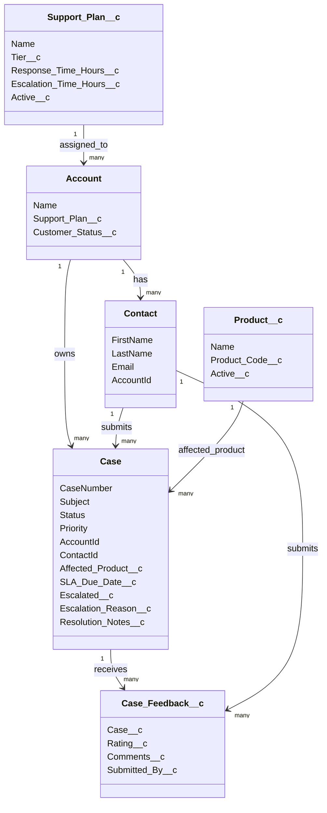

# Phase 3: Data Model Notes

## What We Built

Phase 3 created the first real SupportFlow CRM data model. Phase 3.5 pivots that model toward healthcare operations and the Confluent Health Salesforce Developer posting.

In Salesforce terms:

- An **object** is similar to a database table.
- A **record** is similar to a row in that table.
- A **field** is similar to a column.
- A **lookup field** creates a relationship between records.
- A **tab** lets users open an object from the app navigation.
- A **profile** controls whether a user can see objects, tabs, and fields.

## Custom Objects

### `Support_Plan__c`

Represents a customer's support tier.

Fields:

- `Tier__c`: Basic, Premium, or Enterprise.
- `Response_Time_Hours__c`: target first response time.
- `Escalation_Time_Hours__c`: target time before escalation.
- `Active__c`: whether this plan is currently usable.

Why it exists:

Cases will eventually use the account's support plan to calculate priority and SLA deadlines.

### `Product__c`

Represents a product that customers can open cases about.

Fields:

- `Product_Code__c`: short unique product identifier.
- `Active__c`: whether the product is active.

Why it exists:

Cases can be connected to the affected product, which helps reporting and support routing.

### `Case_Feedback__c`

Represents customer feedback after a case is resolved.

Fields:

- `Case__c`: lookup to the related `Case`.
- `Rating__c`: numeric score.
- `Comments__c`: customer feedback text.
- `Submitted_By__c`: lookup to the `Contact` who submitted feedback.

Why it exists:

It lets us report on customer satisfaction by account, product, and support process.

### `Integration_Log__c`

Represents API or enterprise system integration events.

Fields:

- `Related_Case__c`: lookup to the case involved in the integration.
- `External_System__c`: name of the external platform.
- `Status__c`: Success, Warning, Error, or Retry Scheduled.
- `Status_Code__c`: numeric response/status code.
- `Message__c`: error or response detail.
- `Retry_Count__c`: number of retry attempts.
- `Last_Attempted_At__c`: most recent integration attempt time.

Why it exists:

The job posting specifically mentions integrations, API monitoring, and proactive error resolution. This object gives us a realistic place to log and report integration failures.

## Standard Object Extensions

### `Account`

Added fields:

- `Support_Plan__c`: lookup to `Support_Plan__c`.
- `Customer_Status__c`: Prospect, Active, At Risk, or Inactive.

Why we extended `Account`:

Salesforce already has a strong standard object for customer companies, so we extend it instead of creating a new `Customer__c` object.

### `Case`

Added fields:

- `Affected_Product__c`: lookup to `Product__c`.
- `Request_Type__c`: healthcare operations request category.
- `Clinic_Location__c`: clinic or operating location involved.
- `Contains_PHI__c`: marks possible protected health information.
- `Compliance_Category__c`: Operational, HIPAA, SOC 2, or GDPR.
- `External_System_Id__c`: identifier from an external enterprise system.
- `Integration_Status__c`: sync state with external systems.
- `SLA_Due_Date__c`: date/time by which the case should be handled.
- `Escalated__c`: checkbox for escalated cases.
- `Escalation_Reason__c`: explanation for escalation.
- `Resolution_Notes__c`: notes required when the case is closed.

Why we extended `Case`:

Salesforce already has a standard support ticket object, so we reuse it and add support-specific data.

## Important Lesson: Metadata vs Permissions

Creating an object or field does not automatically mean the user can see it.

We had to deploy:

- Object metadata
- Field metadata
- Custom tabs
- App navigation updates
- Profile object permissions
- Profile field permissions
- Profile tab visibility

That is why Salesforce development always involves both data modeling and security modeling.

## Important Lesson: Naming Conflicts

We originally tried to create `Case.Product__c`, but the org already had a field with that API name as a different type.

Salesforce rejected the deploy because an existing field cannot be changed into a lookup relationship.

We renamed our field to:

```text
Case.Affected_Product__c
```

This is a better business name and avoids the collision.

## Important Lesson: Required Fields

We initially made some fields required at the schema level.

Then Salesforce rejected profile field permission deployment for a required field. For this project, we changed those fields to optional at the schema level.

Later, Phase 5 will use validation rules for requirements like:

- Feedback rating must be between 1 and 5.
- Closed cases require resolution notes.
- Critical cases require an escalation reason.

Validation rules are better for business rules because they can show custom error messages and can be conditional.

## Current Data Model



## CLI Commands Used

Deploy metadata:

```powershell
sf project deploy start --source-dir force-app\main\default\objects --source-dir force-app\main\default\tabs --source-dir force-app\main\default\applications\SupportFlow_CRM.app-meta.xml --source-dir force-app\main\default\profiles\Admin.profile-meta.xml --target-org SupportFlowDev
```

Verify custom objects:

```powershell
sf data query --target-org SupportFlowDev --query "SELECT QualifiedApiName, Label FROM EntityDefinition WHERE QualifiedApiName IN ('Support_Plan__c','Product__c','Case_Feedback__c') ORDER BY QualifiedApiName"
```

Describe an object:

```powershell
sf sobject describe --target-org SupportFlowDev --sobject Case
```
